# Polyglot Codebase Knowledge Graph

> Generated offline by **readmenator**. 3 files, 43 symbols, 34 imports. Supports C, C++, Python, Go, Rust, JS/TS, Java, C#, Shell, PHP, Dart, GDScript, Nim, ASM, Ruby, Swift, Kotlin, Scala, Lua, Elixir.
> No LLMs. No tokens. Pure static analysis. See more [here](https://github.com/grisuno/ReadMenator)

**Start here:** Statistics Dashboard for scope, God Nodes for blast radius, Architecture Reference for per-file API. Agents: prefer `readmenator-agent/INDEX.md` + `SYMBOLS.md`.

**Wiki:** prefer `readmenator-wiki/index.md` for progressive disclosure: one synthesis page per community, `connections.json` with EXTRACTED vs INFERRED confidence, `queries.md` log, `REPORT.md` audit.

**Confidence:** EXTRACTED = parsed from source, INFERRED = heuristic bridge, AMBIGUOUS = reported, never hidden. See `readmenator-wiki/REPORT.md`.

**Total Files Parsed:** 3 | **Total Symbols Extracted:** 43 | **Total Imports:** 34

<!-- ranking_model: v1.0 | weights: {ppr:0.45,auth:0.2,test:0.15,doc:0.1,fresh:0.1} | alpha:0.85 | commit:1e0fd0b | date:2026-07-18 -->


## Table of Contents

1. [Statistics Dashboard](#statistics-dashboard)
2. [Architectural Layers](#architectural-layers)
3. [Ranked Context](#ranked-context)
4. [God Nodes](#god-nodes)
5. [Suggested Questions](#suggested-questions)
6. [Taint Propagation Map](#taint-propagation-map)
7. [Hotspot Analysis](#hotspot-analysis)
8. [Change Impact Analysis](#change-impact-analysis)
9. [Suggested Linting Rules](#suggested-linting-rules)
10. [Dataflow Analysis](#dataflow-analysis)
11. [Concept Graph](#concept-graph)
12. [Orphans](#orphans)
13. [Query Recipes](#query-recipes)
14. [Structural Knowledge Map](#structural-knowledge-map)
15. [UML Class Diagram](#uml-class-diagram)
16. [Code Property Graph](#code-property-graph)
17. [Architecture Reference](#architecture-reference)
    - [C (1 files)](#c-1-files)
    - [PY (1 files)](#py-1-files)
    - [SH (1 files)](#sh-1-files)

---

## Statistics Dashboard

| Metric | Value |
|--------|-------|
| Total Files | 3 |
| Total Symbols | 43 |
| Total Imports | 34 |
| Call Edges | 33 |
| Inheritance Edges | 0 |
| Languages | 3 |
| Avg Symbols/File | 14.3 |
| Avg Imports/File | 11.3 |

### Top Files by Import Count (Fan-Out)

| File | Imports | Symbols | Language |
|------|---------|---------|----------|
| `phantom.c` | 30 | 40 | c |
| `server.py` | 4 | 3 | py |

---

## Architectural Layers

Auto-detected from path patterns, naming conventions, and imported frameworks.

| Layer | Files |
|-------|-------|
| utility | 3 |

### utility

- `compile_run.sh` (sh, 0 symbols)
- `phantom.c` (c, 40 symbols)
- `server.py` (py, 3 symbols)

---

## Ranked Context

Files ranked by composite score for the current query context. The ranking combines Personalized PageRank (query relevance), global authority, test coverage, documentation coverage, and code freshness. Model: v1.0.

| Rank | File | Composite | PPR | Authority | Test | Doc |
|------|------|-----------|-----|-----------|------|-----|
| 1 | `server.py` | 0.0667 | 0.0000 | 0.0000 | 0.00 | 0.67 |
| 2 | `phantom.c` | 0.0275 | 0.0000 | 0.0000 | 0.00 | 0.28 |
| 3 | `compile_run.sh` | 0.0000 | 0.0000 | 0.0000 | 0.00 | 0.00 |

---

## God Nodes

Most architecturally central files ranked by combined import/export degree and symbol richness.

| File | Score | Connections | PageRank |
|------|-------|-------------|----------|
| `phantom.c` | 4.0 | | 0.0000 |
| `server.py` | 0.3 | | 0.0000 |
| `compile_run.sh` | 0.0 | | 0.0000 |

---

## Suggested Questions

Auto-generated exploration prompts based on graph structure:

- What does phantom.c depend on, and what depends on it? (0 connections)
- What does server.py depend on, and what depends on it? (0 connections)
- What does compile_run.sh depend on, and what depends on it? (0 connections)
- What is io_uring_sq in phantom.c and how is it used?
- What is the overall architecture of this codebase?

---

## Taint Propagation Map

Taint analysis traces how dangerous imports propagate through the codebase via transitive dependencies. Source files import dangerous modules directly; sink files receive the danger indirectly.

**Taint Sources:** 1 | **Taint Sinks:** 1 | **Propagation Paths:** 1

- `phantom.c` imports `input` (0 hop to `phantom.c`) [medium]
  Path: phantom.c

---

## Hotspot Analysis

Files ranked by combined complexity (symbol count) and centrality (connection count). High-scoring files are architecturally critical and may need refactoring attention.

| File | Complexity | Centrality | Combined | Symbols | Connections |
|------|-----------|------------|----------|---------|-------------|
| `server.py` | 0.075 | 0.133 | 0.110 | 3 | 4 |
| `phantom.c` | 1.000 | 1.000 | 1.000 | 40 | 30 |
| `compile_run.sh` | 0.000 | 0.000 | 0.000 | 0 | 0 |

---

## Dataflow Analysis

Procedural intra-function dataflow findings (zero tokens, regex-based heuristics, all INFERRED). Each lead is grounded at file:line for manual review.

**1 findings** (UNCHECKED_ALLOC: 1).

| File | Function | Line | Kind | Variable | Description |
|------|----------|------|------|----------|-------------|
| `server.py` | `main` | 26 | `UNCHECKED_ALLOC` | `s` | Result of allocator stored in `s` is never checked against NULL. |

---

## Concept Graph

Semantic second-brain layer: nouns are concept nodes, verbs are edges. Each noun maps atomically to a file set (EXTRACTED); each verb aggregates structural imports, calls, and inherits into consumes, invokes, extends, depends_on, or bridges (INFERRED).

**3 concepts, 0 relations.**

| Concept | Files | Mentions |
|---------|-------|----------|
| `recv` | 2 | 3 |
| `run` | 2 | 3 |
| `server` | 2 | 3 |

### Dialectic Prompts

- Thesis: `recv` centralizes 2 files; Antithesis: `server` pulls 2 files with 2 shared (Jaccard 1.00); Synthesis: should they merge, split by layer, or keep `bridges` explicit?

---

## Change Impact Analysis

Files sorted by how many other files would be affected if they changed. High-impact files should be changed with caution.

| File | Direct Dependents | Transitive Dependents | Total Impact |
|------|------------------|----------------------|--------------|
| `compile_run.sh` | 0 | 0 | 0 |
| `phantom.c` | 0 | 0 | 0 |
| `server.py` | 0 | 0 | 0 |

---

## Suggested Linting Rules

Automatically suggested linting and security rules based on patterns detected in the codebase. These can be exported as Semgrep rules using the `--export-rules` flag.

| Rule ID | Severity | Description | Language | Matches |
|---------|----------|-------------|----------|---------|
| `RM001` | info | Large number of functions in c: 26 total | c | 26 |
| `RM002` | info | Large number of functions in py: 3 total | py | 3 |
| `RM003` | info | Print statement found (consider logging instead) | python | 5 |

---

## Orphans

Files with no documentation or low connectivity. These are candidates for documentation investment or cleanup.

- `compile_run.sh` (0 symbols, no doc)

---

## Query Recipes

Example queries you can run against this knowledge base using the ranking engine:

```
# Find files most relevant to a concept
readmenator query "Where is the import resolver implemented?"

# Rank files by relevance to a topic
readmenator query "How does documentation generation work?"

# Explain why a file ranks highly
readmenator query "explain readmenator/_documentation.py"

# Trace dependency paths with ranked context
readmenator query "path from CLI to exporter"
```

The ranking model uses the following signals:

- **Personalized PageRank** (45% weight): query-specific relevance via seed propagation
- **Global Authority** (20% weight): structural importance via standard PageRank
- **Test Coverage** (15% weight): fraction of symbols referenced in test files
- **Doc Coverage** (10% weight): presence of docstrings and file-level docs
- **Freshness** (10% weight): recent modification activity

Results include score decomposition and justification paths for each ranked item.

---

## Structural Knowledge Map

```mermaid
graph TD
    classDef mod fill:#1e1e1e,stroke:#ff6666,stroke-width:2px,color:#fff;
    classDef cls fill:#2d2d2d,stroke:#4ec9b0,stroke-width:2px,color:#fff;
    classDef fn fill:#333,stroke:#dcdcaa,stroke-width:1px,color:#dcdcaa;
    classDef ext fill:#111,stroke:#666,stroke-dasharray:5 5,color:#aaa;
    phantom_c["phantom.c (c)"]
    class phantom_c mod;
    phantom_c_io_uring_sq["io_uring_sq"]
    class phantom_c_io_uring_sq cls;
    phantom_c --> phantom_c_io_uring_sq
    phantom_c_io_uring_cq["io_uring_cq"]
    class phantom_c_io_uring_cq cls;
    phantom_c --> phantom_c_io_uring_cq
    phantom_c_io_uring["io_uring"]
    class phantom_c_io_uring cls;
    phantom_c --> phantom_c_io_uring
    phantom_c_c2_command_t["c2_command_t"]
    class phantom_c_c2_command_t cls;
    phantom_c --> phantom_c_c2_command_t
    phantom_c_c2_response_t["c2_response_t"]
    class phantom_c_c2_response_t cls;
    phantom_c --> phantom_c_c2_response_t
    server_py["server.py (py)"]
    class server_py mod;
    compile_run_sh["compile_run.sh (sh)"]
    class compile_run_sh mod;
    ext_stdio_h["stdio.h"]
    class ext_stdio_h ext;
    phantom_c -.->|imports| ext_stdio_h
    ext_stdlib_h["stdlib.h"]
    class ext_stdlib_h ext;
    phantom_c -.->|imports| ext_stdlib_h
    ext_string_h["string.h"]
    class ext_string_h ext;
    phantom_c -.->|imports| ext_string_h
    ext_unistd_h["unistd.h"]
    class ext_unistd_h ext;
    phantom_c -.->|imports| ext_unistd_h
    ext_errno_h["errno.h"]
    class ext_errno_h ext;
    phantom_c -.->|imports| ext_errno_h
    ext_fcntl_h["fcntl.h"]
    class ext_fcntl_h ext;
    phantom_c -.->|imports| ext_fcntl_h
    ext_signal_h["signal.h"]
    class ext_signal_h ext;
    phantom_c -.->|imports| ext_signal_h
    ext_sys_types_h["types.h"]
    class ext_sys_types_h ext;
    phantom_c -.->|imports| ext_sys_types_h
    ext_sys_socket_h["socket.h"]
    class ext_sys_socket_h ext;
    phantom_c -.->|imports| ext_sys_socket_h
    ext_netinet_in_h["in.h"]
    class ext_netinet_in_h ext;
    phantom_c -.->|imports| ext_netinet_in_h
    ext_arpa_inet_h["inet.h"]
    class ext_arpa_inet_h ext;
    phantom_c -.->|imports| ext_arpa_inet_h
    ext_netdb_h["netdb.h"]
    class ext_netdb_h ext;
    phantom_c -.->|imports| ext_netdb_h
    ext_sys_stat_h["stat.h"]
    class ext_sys_stat_h ext;
    phantom_c -.->|imports| ext_sys_stat_h
    ext_dirent_h["dirent.h"]
    class ext_dirent_h ext;
    phantom_c -.->|imports| ext_dirent_h
    ext_pthread_h["pthread.h"]
    class ext_pthread_h ext;
    phantom_c -.->|imports| ext_pthread_h
    ext_sys_mman_h["mman.h"]
    class ext_sys_mman_h ext;
    phantom_c -.->|imports| ext_sys_mman_h
    ext_sys_syscall_h["syscall.h"]
    class ext_sys_syscall_h ext;
    phantom_c -.->|imports| ext_sys_syscall_h
    ext_linux_io_uring_h["io_uring.h"]
    class ext_linux_io_uring_h ext;
    phantom_c -.->|imports| ext_linux_io_uring_h
    ext_stdarg_h["stdarg.h"]
    class ext_stdarg_h ext;
    phantom_c -.->|imports| ext_stdarg_h
    ext_time_h["time.h"]
    class ext_time_h ext;
    phantom_c -.->|imports| ext_time_h
    ext_sys_time_h["time.h"]
    class ext_sys_time_h ext;
    phantom_c -.->|imports| ext_sys_time_h
    ext_sys_wait_h["wait.h"]
    class ext_sys_wait_h ext;
    phantom_c -.->|imports| ext_sys_wait_h
    ext_pwd_h["pwd.h"]
    class ext_pwd_h ext;
    phantom_c -.->|imports| ext_pwd_h
    ext_grp_h["grp.h"]
    class ext_grp_h ext;
    phantom_c -.->|imports| ext_grp_h
    ext_linux_limits_h["limits.h"]
    class ext_linux_limits_h ext;
    phantom_c -.->|imports| ext_linux_limits_h
    ext_poll_h["poll.h"]
    class ext_poll_h ext;
    phantom_c -.->|imports| ext_poll_h
    ext_stdint_h["stdint.h"]
    class ext_stdint_h ext;
    phantom_c -.->|imports| ext_stdint_h
    ext_linux_input_h["input.h"]
    class ext_linux_input_h ext;
    phantom_c -.->|imports| ext_linux_input_h
    ext_sys_resource_h["resource.h"]
    class ext_sys_resource_h ext;
    phantom_c -.->|imports| ext_sys_resource_h
    ext_sys_prctl_h["prctl.h"]
    class ext_sys_prctl_h ext;
    phantom_c -.->|imports| ext_sys_prctl_h
    ext_socket["socket"]
    class ext_socket ext;
    server_py -.->|imports| ext_socket
    ext_struct["struct"]
    class ext_struct ext;
    server_py -.->|imports| ext_struct
    ext_time["time"]
    class ext_time ext;
    server_py -.->|imports| ext_time
    ext_random["random"]
    class ext_random ext;
    server_py -.->|imports| ext_random
```



---

## UML Class Diagram

Auto-generated Mermaid class diagram from parsed class-level symbols. Shows classes, structs, interfaces, traits, and their methods with inheritance and dependency relationships.

```mermaid
classDiagram
  class phantom_c_io_uring_sq {
    <<struct>>
    +__io_uring_setup(unsigned int entries, struct io_uring_params *p)
    +__io_uring_enter(int fd, unsigned int to_submit, unsigned int min_complete,
   ...
    +__io_uring_register(int fd, unsigned int opcode, const void *arg, unsigned int ...
    +uring_queue_init(unsigned int entries, struct io_uring *ring)
    +uring_get_sqe(struct io_uring *ring)
    +uring_submit(struct io_uring *ring)
    +uring_wait_cqe_timeout(struct io_uring *ring, struct io_uring_cqe **cqe_ptr, int timeo...
    +uring_cqe_seen(struct io_uring *ring, struct io_uring_cqe *cqe)
    +chacha20_keystream(uint32_t counter, uint8_t *key, uint8_t *nonce, uint8_t *out, size...
    +encrypt_payload(uint8_t *data, size_t len, uint8_t *key, uint8_t *nonce)
  }
  class phantom_c_io_uring_cq {
    <<struct>>
    +__io_uring_setup(unsigned int entries, struct io_uring_params *p)
    +__io_uring_enter(int fd, unsigned int to_submit, unsigned int min_complete,
   ...
    +__io_uring_register(int fd, unsigned int opcode, const void *arg, unsigned int ...
    +uring_queue_init(unsigned int entries, struct io_uring *ring)
    +uring_get_sqe(struct io_uring *ring)
    +uring_submit(struct io_uring *ring)
    +uring_wait_cqe_timeout(struct io_uring *ring, struct io_uring_cqe **cqe_ptr, int timeo...
    +uring_cqe_seen(struct io_uring *ring, struct io_uring_cqe *cqe)
    +chacha20_keystream(uint32_t counter, uint8_t *key, uint8_t *nonce, uint8_t *out, size...
    +encrypt_payload(uint8_t *data, size_t len, uint8_t *key, uint8_t *nonce)
  }
  class phantom_c_io_uring {
    <<struct>>
    +__io_uring_setup(unsigned int entries, struct io_uring_params *p)
    +__io_uring_enter(int fd, unsigned int to_submit, unsigned int min_complete,
   ...
    +__io_uring_register(int fd, unsigned int opcode, const void *arg, unsigned int ...
    +uring_queue_init(unsigned int entries, struct io_uring *ring)
    +uring_get_sqe(struct io_uring *ring)
    +uring_submit(struct io_uring *ring)
    +uring_wait_cqe_timeout(struct io_uring *ring, struct io_uring_cqe **cqe_ptr, int timeo...
    +uring_cqe_seen(struct io_uring *ring, struct io_uring_cqe *cqe)
    +chacha20_keystream(uint32_t counter, uint8_t *key, uint8_t *nonce, uint8_t *out, size...
    +encrypt_payload(uint8_t *data, size_t len, uint8_t *key, uint8_t *nonce)
  }
  class phantom_c_c2_command_t {
    <<struct>>
    +__io_uring_setup(unsigned int entries, struct io_uring_params *p)
    +__io_uring_enter(int fd, unsigned int to_submit, unsigned int min_complete,
   ...
    +__io_uring_register(int fd, unsigned int opcode, const void *arg, unsigned int ...
    +uring_queue_init(unsigned int entries, struct io_uring *ring)
    +uring_get_sqe(struct io_uring *ring)
    +uring_submit(struct io_uring *ring)
    +uring_wait_cqe_timeout(struct io_uring *ring, struct io_uring_cqe **cqe_ptr, int timeo...
    +uring_cqe_seen(struct io_uring *ring, struct io_uring_cqe *cqe)
    +chacha20_keystream(uint32_t counter, uint8_t *key, uint8_t *nonce, uint8_t *out, size...
    +encrypt_payload(uint8_t *data, size_t len, uint8_t *key, uint8_t *nonce)
  }
  class phantom_c_c2_response_t {
    <<struct>>
    +__io_uring_setup(unsigned int entries, struct io_uring_params *p)
    +__io_uring_enter(int fd, unsigned int to_submit, unsigned int min_complete,
   ...
    +__io_uring_register(int fd, unsigned int opcode, const void *arg, unsigned int ...
    +uring_queue_init(unsigned int entries, struct io_uring *ring)
    +uring_get_sqe(struct io_uring *ring)
    +uring_submit(struct io_uring *ring)
    +uring_wait_cqe_timeout(struct io_uring *ring, struct io_uring_cqe **cqe_ptr, int timeo...
    +uring_cqe_seen(struct io_uring *ring, struct io_uring_cqe *cqe)
    +chacha20_keystream(uint32_t counter, uint8_t *key, uint8_t *nonce, uint8_t *out, size...
    +encrypt_payload(uint8_t *data, size_t len, uint8_t *key, uint8_t *nonce)
  }
```



---

## Code Property Graph

Machine-readable Code Property Graph (CPG) in JSON-LD format. This block allows AI agents to parse the full structural graph without additional file reads. Compatible with GraphRAG pipelines.

```json
{"@context": "https://schema.org", "analysis": {"communities": [], "god_nodes": [{"node_id": "phantom.c", "score": 4.0}, {"node_id": "server.py", "score": 0.3}, {"node_id": "compile_run.sh", "score": 0.0}], "surprising_connections": []}, "edges": [{"confidence": "EXTRACTED", "relation": "imports", "source": "phantom.c", "target": "stdio.h"}, {"confidence": "EXTRACTED", "relation": "imports", "source": "phantom.c", "target": "stdlib.h"}, {"confidence": "EXTRACTED", "relation": "imports", "source": "phantom.c", "target": "string.h"}, {"confidence": "EXTRACTED", "relation": "imports", "source": "phantom.c", "target": "unistd.h"}, {"confidence": "EXTRACTED", "relation": "imports", "source": "phantom.c", "target": "errno.h"}, {"confidence": "EXTRACTED", "relation": "imports", "source": "phantom.c", "target": "fcntl.h"}, {"confidence": "EXTRACTED", "relation": "imports", "source": "phantom.c", "target": "signal.h"}, {"confidence": "EXTRACTED", "relation": "imports", "source": "phantom.c", "target": "sys/types.h"}, {"confidence": "EXTRACTED", "relation": "imports", "source": "phantom.c", "target": "sys/socket.h"}, {"confidence": "EXTRACTED", "relation": "imports", "source": "phantom.c", "target": "netinet/in.h"}, {"confidence": "EXTRACTED", "relation": "imports", "source": "phantom.c", "target": "arpa/inet.h"}, {"confidence": "EXTRACTED", "relation": "imports", "source": "phantom.c", "target": "netdb.h"}, {"confidence": "EXTRACTED", "relation": "imports", "source": "phantom.c", "target": "sys/stat.h"}, {"confidence": "EXTRACTED", "relation": "imports", "source": "phantom.c", "target": "dirent.h"}, {"confidence": "EXTRACTED", "relation": "imports", "source": "phantom.c", "target": "pthread.h"}, {"confidence": "EXTRACTED", "relation": "imports", "source": "phantom.c", "target": "sys/mman.h"}, {"confidence": "EXTRACTED", "relation": "imports", "source": "phantom.c", "target": "sys/syscall.h"}, {"confidence": "EXTRACTED", "relation": "imports", "source": "phantom.c", "target": "linux/io_uring.h"}, {"confidence": "EXTRACTED", "relation": "imports", "source": "phantom.c", "target": "stdarg.h"}, {"confidence": "EXTRACTED", "relation": "imports", "source": "phantom.c", "target": "time.h"}, {"confidence": "EXTRACTED", "relation": "imports", "source": "phantom.c", "target": "sys/time.h"}, {"confidence": "EXTRACTED", "relation": "imports", "source": "phantom.c", "target": "sys/wait.h"}, {"confidence": "EXTRACTED", "relation": "imports", "source": "phantom.c", "target": "pwd.h"}, {"confidence": "EXTRACTED", "relation": "imports", "source": "phantom.c", "target": "grp.h"}, {"confidence": "EXTRACTED", "relation": "imports", "source": "phantom.c", "target": "linux/limits.h"}, {"confidence": "EXTRACTED", "relation": "imports", "source": "phantom.c", "target": "poll.h"}, {"confidence": "EXTRACTED", "relation": "imports", "source": "phantom.c", "target": "stdint.h"}, {"confidence": "EXTRACTED", "relation": "imports", "source": "phantom.c", "target": "linux/input.h"}, {"confidence": "EXTRACTED", "relation": "imports", "source": "phantom.c", "target": "sys/resource.h"}, {"confidence": "EXTRACTED", "relation": "imports", "source": "phantom.c", "target": "sys/prctl.h"}, {"confidence": "EXTRACTED", "relation": "imports", "source": "server.py", "target": "socket"}, {"confidence": "EXTRACTED", "relation": "imports", "source": "server.py", "target": "struct"}, {"confidence": "EXTRACTED", "relation": "imports", "source": "server.py", "target": "time"}, {"confidence": "EXTRACTED", "relation": "imports", "source": "server.py", "target": "random"}], "generator": "readmenator", "metadata": {"edge_count": 67, "file_count": 3, "language_count": 3, "symbol_count": 43}, "nodes": [{"id": "compile_run.sh", "kind": "module", "label": "compile_run.sh", "language": "sh", "sha256": "60bf2a654b26c559", "symbol_count": 0, "symbols": []}, {"id": "phantom.c", "kind": "module", "label": "phantom.c", "language": "c", "sha256": "dd2a096bdc72ca29", "symbol_count": 40, "symbols": [{"doc": "--------------------------------------------------------------------- IO_URING MANUAL (sin liburing) ----------------------------------------------------------------------", "kind": "struct", "line": 54, "name": "io_uring_sq"}, {"kind": "struct", "line": 58, "name": "io_uring_cq"}, {"kind": "struct", "line": 62, "name": "io_uring"}, {"doc": "--------------------------------------------------------------------- ESTRUCTURA DE COMANDOS C2 ----------------------------------------------------------------------", "kind": "struct", "line": 171, "name": "c2_command_t"}, {"kind": "struct", "line": 177, "name": "c2_response_t"}, {"kind": "function", "line": 69, "name": "__io_uring_setup", "signature": "static inline int __io_uring_setup(unsigned int entries, struct io_uring_params *p)"}, {"kind": "function", "line": 72, "name": "__io_uring_enter", "signature": "static inline int __io_uring_enter(int fd, unsigned int to_submit, unsigned int min_complete,\n   ..."}, {"kind": "function", "line": 76, "name": "__io_uring_register", "signature": "static inline int __io_uring_register(int fd, unsigned int opcode, const void *arg, unsigned int ..."}, {"kind": "function", "line": 80, "name": "uring_queue_init", "signature": "static int uring_queue_init(unsigned int entries, struct io_uring *ring)"}, {"kind": "function", "line": 120, "name": "uring_get_sqe", "signature": "static struct io_uring_sqe *uring_get_sqe(struct io_uring *ring)"}, {"kind": "function", "line": 128, "name": "uring_submit", "signature": "static int uring_submit(struct io_uring *ring)"}, {"kind": "function", "line": 134, "name": "uring_wait_cqe_timeout", "signature": "static int uring_wait_cqe_timeout(struct io_uring *ring, struct io_uring_cqe **cqe_ptr, int timeo..."}, {"kind": "function", "line": 143, "name": "uring_cqe_seen", "signature": "static inline void uring_cqe_seen(struct io_uring *ring, struct io_uring_cqe *cqe)"}, {"kind": "function", "line": 155, "name": "chacha20_keystream", "signature": "static void chacha20_keystream(uint32_t counter, uint8_t *key, uint8_t *nonce, uint8_t *out, size..."}, {"kind": "function", "line": 161, "name": "encrypt_payload", "signature": "static void encrypt_payload(uint8_t *data, size_t len, uint8_t *key, uint8_t *nonce)"}, {"kind": "function", "line": 221, "name": "uring_read", "signature": "static ssize_t uring_read(int fd, void *buf, size_t count, off_t offset)"}, {"kind": "function", "line": 243, "name": "uring_write", "signature": "static ssize_t uring_write(int fd, const void *buf, size_t count, off_t offset)"}, {"doc": "--------------------------------------------------------------------- EJECUCIÓN DE COMANDOS ----------------------------------------------------------------------", "kind": "function", "line": 268, "name": "run_shell_command", "signature": "static char *run_shell_command(const char *cmd)"}, {"doc": "--------------------------------------------------------------------- SUBIR / BAJAR ARCHIVOS ----------------------------------------------------------------------", "kind": "function", "line": 303, "name": "upload_file", "signature": "static int upload_file(const char *local_path, const char *remote_path)"}, {"kind": "function", "line": 319, "name": "download_file", "signature": "static int download_file(const char *remote_path, const char *local_path)"}, {"doc": "--------------------------------------------------------------------- PERSISTENCIA ----------------------------------------------------------------------", "kind": "function", "line": 326, "name": "install_persistence", "signature": "static void install_persistence(void)"}, {"doc": "--------------------------------------------------------------------- CAPTURA DE PANTALLA ----------------------------------------------------------------------", "kind": "function", "line": 400, "name": "take_screenshot", "signature": "static void take_screenshot(const char *outfile)"}, {"doc": "--------------------------------------------------------------------- C2 COMUNICACIÓN ----------------------------------------------------------------------", "kind": "function", "line": 409, "name": "connect_c2", "signature": "static int connect_c2(void)"}, {"kind": "function", "line": 424, "name": "recv_encrypted", "signature": "static int recv_encrypted(int sock, void *buf, size_t len, unsigned char *key)"}, {"kind": "function", "line": 431, "name": "send_encrypted", "signature": "static int send_encrypted(int sock, const void *buf, size_t len, unsigned char *key)"}, {"kind": "function", "line": 441, "name": "recv_command", "signature": "static c2_command_t recv_command(int sock)"}, {"kind": "function", "line": 453, "name": "send_response", "signature": "static void send_response(int sock, c2_response_t *resp)"}, {"doc": "--------------------------------------------------------------------- PROCESADOR DE COMANDOS ----------------------------------------------------------------------", "kind": "function", "line": 462, "name": "process_command", "signature": "static void process_command(int sock, c2_command_t *cmd)"}, {"doc": "--------------------------------------------------------------------- HILO PRINCIPAL C2 ----------------------------------------------------------------------", "kind": "function", "line": 563, "name": "c2_loop", "signature": "static void *c2_loop(void *arg)"}, {"doc": "--------------------------------------------------------------------- ANTI‑FORENSE ----------------------------------------------------------------------", "kind": "function", "line": 600, "name": "anti_forensics", "signature": "static void anti_forensics(void)"}, {"doc": "--------------------------------------------------------------------- MAIN ----------------------------------------------------------------------", "kind": "function", "line": 611, "name": "main", "signature": "int main(int argc, char **argv)"}, {"kind": "macro", "line": 7, "name": "_GNU_SOURCE", "signature": "#define _GNU_SOURCE"}, {"kind": "macro", "line": 42, "name": "DEFAULT_SERVER", "signature": "#define DEFAULT_SERVER"}, {"kind": "macro", "line": 43, "name": "DEFAULT_PORT", "signature": "#define DEFAULT_PORT"}, {"kind": "macro", "line": 44, "name": "ENCRYPT_KEY", "signature": "#define ENCRYPT_KEY"}, {"kind": "macro", "line": 45, "name": "BEACON_INTERVAL", "signature": "#define BEACON_INTERVAL"}, {"kind": "macro", "line": 46, "name": "JITTER_PERCENT", "signature": "#define JITTER_PERCENT"}, {"kind": "macro", "line": 47, "name": "IO_URING_QUEUE_DEPTH", "signature": "#define IO_URING_QUEUE_DEPTH"}, {"kind": "macro", "line": 48, "name": "CMD_BUFFER_SIZE", "signature": "#define CMD_BUFFER_SIZE"}, {"kind": "macro", "line": 49, "name": "MAX_PATH", "signature": "#define MAX_PATH"}]}, {"id": "server.py", "kind": "module", "label": "server.py", "language": "py", "sha256": "845297670e03b6e8", "symbol_count": 3, "symbols": [{"doc": "Aplica XOR con la clave definida", "kind": "function", "line": 11, "name": "xor_crypt", "signature": "def xor_crypt(data)"}, {"doc": "Recibe exactamente n bytes", "kind": "function", "line": 15, "name": "recv_exact", "signature": "def recv_exact(sock, n)"}, {"kind": "function", "line": 25, "name": "main", "signature": "def main()"}]}], "type": "CodePropertyGraph", "version": "1.0"}
```

---

## Architecture Reference

### C (1 files)

#### `phantom.c`
**Path:** `phantom.c`

**Functions:**
- `__io_uring_setup` (line 69) `static inline int __io_uring_setup(unsigned int entries, struct io_uring_params *p)`
- `__io_uring_enter` (line 72) `static inline int __io_uring_enter(int fd, unsigned int to_submit, unsigned int min_complete,
   ...`
- `__io_uring_register` (line 76) `static inline int __io_uring_register(int fd, unsigned int opcode, const void *arg, unsigned int ...`
- `uring_queue_init` (line 80) `static int uring_queue_init(unsigned int entries, struct io_uring *ring)`
- `uring_get_sqe` (line 120) `static struct io_uring_sqe *uring_get_sqe(struct io_uring *ring)`
- `uring_submit` (line 128) `static int uring_submit(struct io_uring *ring)`
- `uring_wait_cqe_timeout` (line 134) `static int uring_wait_cqe_timeout(struct io_uring *ring, struct io_uring_cqe **cqe_ptr, int timeo...`
- `uring_cqe_seen` (line 143) `static inline void uring_cqe_seen(struct io_uring *ring, struct io_uring_cqe *cqe)`
- `chacha20_keystream` (line 155) `static void chacha20_keystream(uint32_t counter, uint8_t *key, uint8_t *nonce, uint8_t *out, size...`
- `encrypt_payload` (line 161) `static void encrypt_payload(uint8_t *data, size_t len, uint8_t *key, uint8_t *nonce)`
- `uring_read` (line 221) `static ssize_t uring_read(int fd, void *buf, size_t count, off_t offset)`
- `uring_write` (line 243) `static ssize_t uring_write(int fd, const void *buf, size_t count, off_t offset)`
- `run_shell_command` (line 268) `static char *run_shell_command(const char *cmd)` - *--------------------------------------------------------------------- EJECUCIÓN DE COMANDOS ----------------------------------------------------------------------*
- `upload_file` (line 303) `static int upload_file(const char *local_path, const char *remote_path)` - *--------------------------------------------------------------------- SUBIR / BAJAR ARCHIVOS ----------------------------------------------------------------------*
- `download_file` (line 319) `static int download_file(const char *remote_path, const char *local_path)`
- `install_persistence` (line 326) `static void install_persistence(void)` - *--------------------------------------------------------------------- PERSISTENCIA ----------------------------------------------------------------------*
- `take_screenshot` (line 400) `static void take_screenshot(const char *outfile)` - *--------------------------------------------------------------------- CAPTURA DE PANTALLA ----------------------------------------------------------------------*
- `connect_c2` (line 409) `static int connect_c2(void)` - *--------------------------------------------------------------------- C2 COMUNICACIÓN ----------------------------------------------------------------------*
- `recv_encrypted` (line 424) `static int recv_encrypted(int sock, void *buf, size_t len, unsigned char *key)`
- `send_encrypted` (line 431) `static int send_encrypted(int sock, const void *buf, size_t len, unsigned char *key)`
- `recv_command` (line 441) `static c2_command_t recv_command(int sock)`
- `send_response` (line 453) `static void send_response(int sock, c2_response_t *resp)`
- `process_command` (line 462) `static void process_command(int sock, c2_command_t *cmd)` - *--------------------------------------------------------------------- PROCESADOR DE COMANDOS ----------------------------------------------------------------------*
- `c2_loop` (line 563) `static void *c2_loop(void *arg)` - *--------------------------------------------------------------------- HILO PRINCIPAL C2 ----------------------------------------------------------------------*
- `anti_forensics` (line 600) `static void anti_forensics(void)` - *--------------------------------------------------------------------- ANTI‑FORENSE ----------------------------------------------------------------------*
- `main` (line 611) `int main(int argc, char **argv)` - *--------------------------------------------------------------------- MAIN ----------------------------------------------------------------------*

**Macros:**
- `_GNU_SOURCE` (line 7) `#define _GNU_SOURCE`
- `DEFAULT_SERVER` (line 42) `#define DEFAULT_SERVER`
- `DEFAULT_PORT` (line 43) `#define DEFAULT_PORT`
- `ENCRYPT_KEY` (line 44) `#define ENCRYPT_KEY`
- `BEACON_INTERVAL` (line 45) `#define BEACON_INTERVAL`
- `JITTER_PERCENT` (line 46) `#define JITTER_PERCENT`
- `IO_URING_QUEUE_DEPTH` (line 47) `#define IO_URING_QUEUE_DEPTH`
- `CMD_BUFFER_SIZE` (line 48) `#define CMD_BUFFER_SIZE`
- `MAX_PATH` (line 49) `#define MAX_PATH`

**Structs:**
- `io_uring_sq` (line 54) - *--------------------------------------------------------------------- IO_URING MANUAL (sin liburing) ----------------------------------------------------------------------*
- `io_uring_cq` (line 58)
- `io_uring` (line 62)
- `c2_command_t` (line 171) - *--------------------------------------------------------------------- ESTRUCTURA DE COMANDOS C2 ----------------------------------------------------------------------*
- `c2_response_t` (line 177)

### PY (1 files)

#### `server.py`
**Path:** `server.py`

**Functions:**
- `xor_crypt` (line 11) `def xor_crypt(data)` - *Aplica XOR con la clave definida*
- `recv_exact` (line 15) `def recv_exact(sock, n)` - *Recibe exactamente n bytes*
- `main` (line 25) `def main()`

### SH (1 files)

#### `compile_run.sh`
**Path:** `compile_run.sh`

*No symbols extracted*
